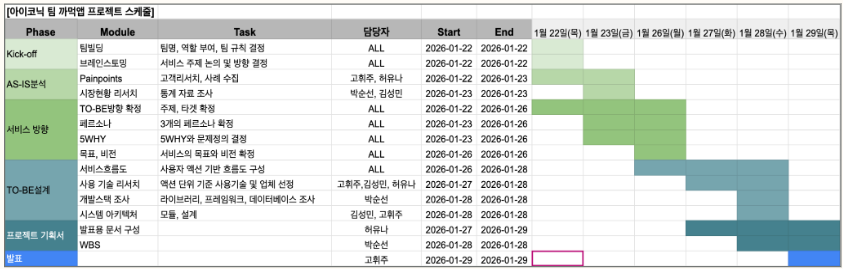
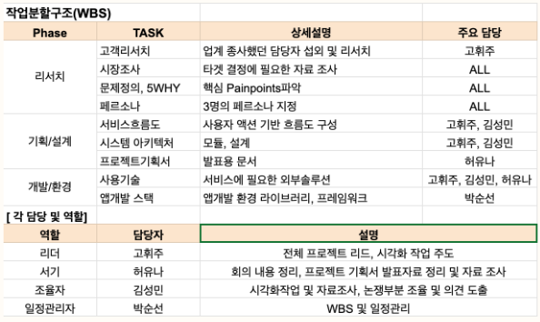
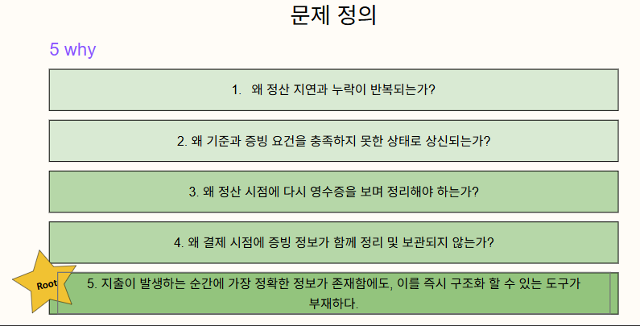
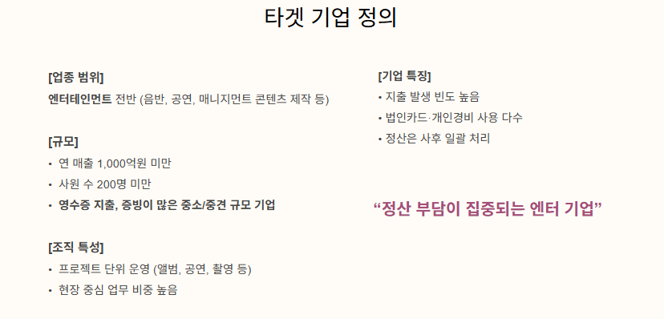
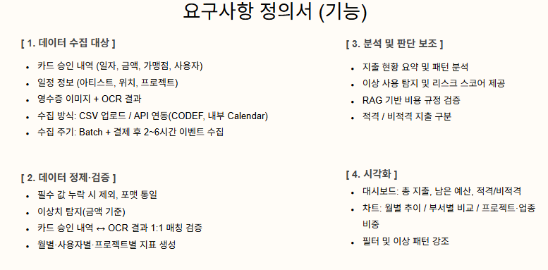
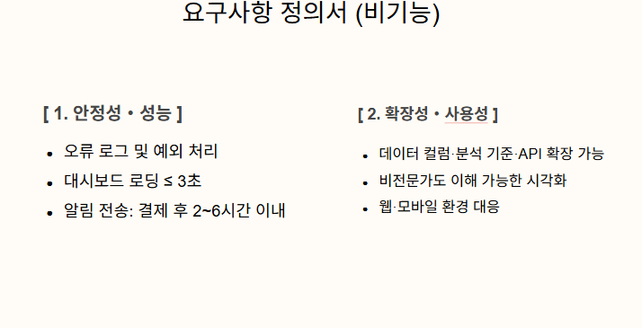
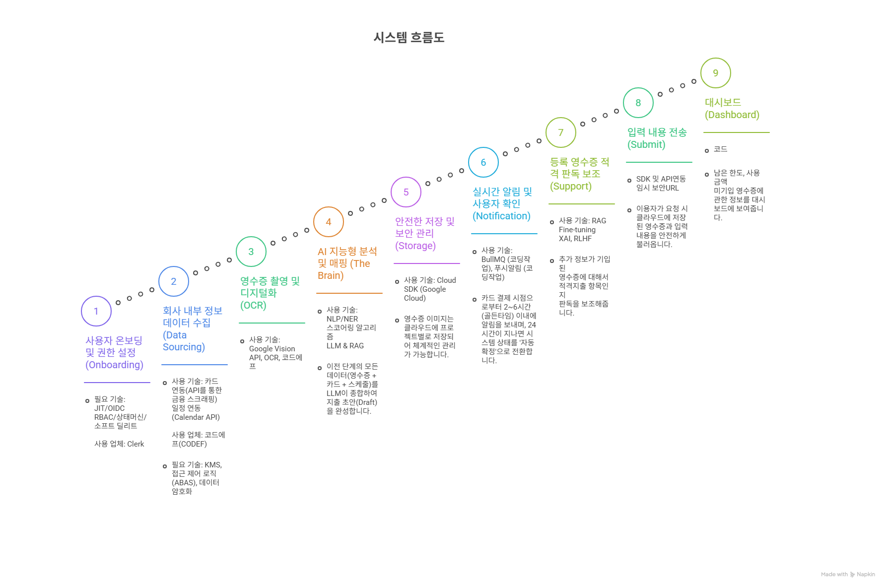
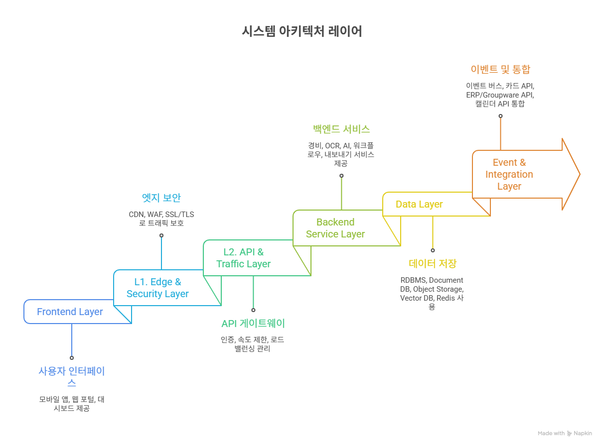
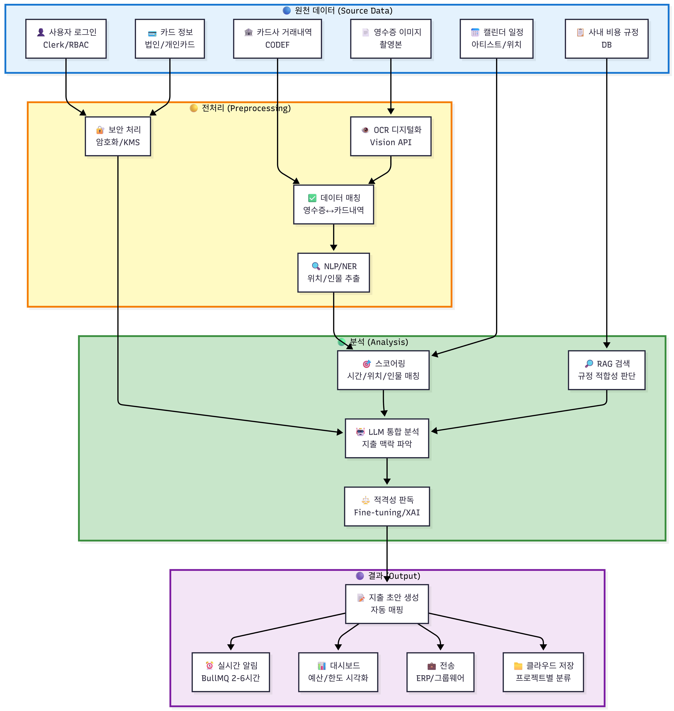
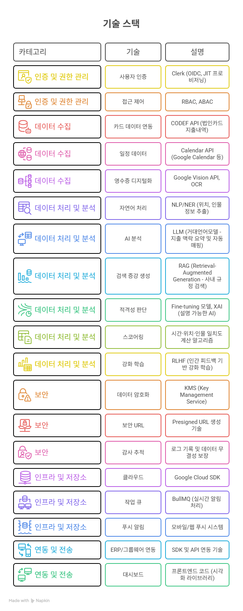

# 🧾 까먹 (Kka-Meok)
**중소 엔터테인먼트 기업을 위한 영수증 정산 프로세스 AI 보조 시스템**

본 프로젝트는 **KPMG Future Academy 8기 3조(Iconic)**의 1차 프로젝트 기획안입니다. 중소 엔터테인먼트사의 고질적인 정산 지연 문제를 AI 기술로 해결하고자 합니다.

---

## 1. 프로젝트 개요 
**프로젝트 기간**: 2026-01-22 ~ 2026-01-29 
**팀 명**: 아이코닉 (Iconic)
**참여 인원**: 고휘주, 허유나, 김성민, 박순선 
* **주제**: 영수증 정산 프로세스 AI 보조 시스템(까먹)

## 2. 프로젝트 일정 (Roadmap)

## 3. 문제 정의 (Problem Definition)

## 4. 타겟 기업 정의 (Target)

## 5. 요구사항 정의 (Requirements)
### 기능 요구사항

### 비기능 요구사항

## 6. 시스템 설계 (System Design)
### 시스템 흐름도

### 시스템 아키텍처

### 데이터 흐름도

## 7. 기술 스택 (Tech Stack)

